# from関数について

from関数は単純にファイルを取り込むだけではなく、プログラムから扱いやすい形式に変換することが出来ます。  

## 書式

byte[] foo = from(ファイル名 [, sc1/sc2/sp8/sp16/tmxmap/tmxmap2/csv] [, rle]);

- sc1 - BMPデータをMSXのSCREEN1のフォント(&カラー)データに変換する。
- sc2 - BMPデータをMSXのSCREEN2のフォント(&カラー)データに変換する。
- sp8 - BMPデータをMSXの8x8スプライトデータ(モード1)に変換する。
- sp16 - BMPデータをMSXの16x16スプライトデータ(モード1)に変換する。
- tmxmap - Tiled Map Editorの出力するマップを取り込む。
- tmxmap2 - Tiled Map Editorの出力するマップを取り込む。ただし1マスが2x2タイル構成とみなす。
- csv - csvのデータを取り込む

※BMPデータはIndexed Color(256色)である必要があり、パレットのうち0～15番の色が取り込み対象になります。

### オプションなし
オプションの指定がない場合は、ファイルの内容をそのままfooに格納します。
```
byte[] foo = from("image.bin");
```

### sc1
BMPデータをMSXのSCREEN1のパターンジェネレータテーブルとカラーテーブル形式のデータに変換します。  
```
byte[] foo = from("image.bmp", sc1);
```
以下のような画像であれば、  
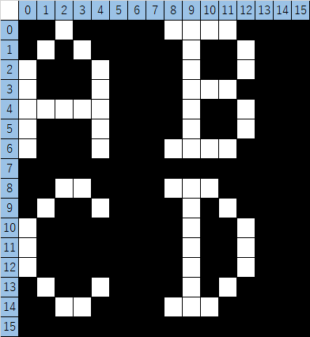  

データは2値化され以下のように並び替えが行われます。  
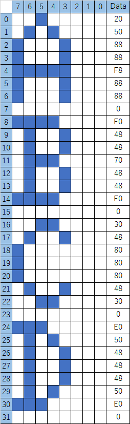  

また、フォントに対応するカラーテーブルのデータは、パターンジェネレータデータの後ろに連結されます。  
SCREEN1の仕様では8つのフォントを1セットとして着色されますのでこの例の場合、0xf0(白と黒)の1バイトだけ連結されます。

### sc2
BMPデータをMSXのSCREEN2のパターンジェネレータテーブルとカラーテーブル形式のデータに変換します。  
パターンジェネレータテーブルはsc1と同じですが、カラーテーブルは1フォント、1ライン毎に設定できます。
```
byte[] foo = from("image.bmp", sc2);
```
以下のような画像であれば、  
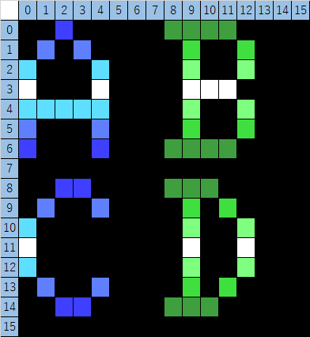  

カラーテーブルのデータは以下のように並びます。  
0x40,0x50,0x70,0xf0,0x70,0x50,0x40,0x00, (Aの色情報)  
0xc0,0x20,0x30,0xf0,0x30,0x20,0xc0,0x00, (Bの色情報)  
0x40,0x50,0x70,0xf0,0x70,0x50,0x40,0x00, (Cの色情報)  
0xc0,0x20,0x30,0xf0,0x30,0x20,0xc0,0x00, (Dの色情報)  

### sp8 / sp16
BMPデータをスプライトパターンジェネレータテーブルのデータに変換します。  
sp8は8x8サイズ用、sp16は16x16サイズ用のデータになりますが、この2つもパターンデータの格納方式に違いはありません。色情報が8x8毎か、16x16毎かの違いになります。  

```
byte[] foo = from("image.bmp", sp8);
byte[] foo = from("image.bmp", sp16);
```

以下のような画像であれば、  
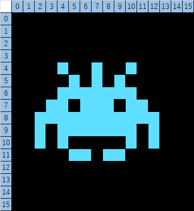  

データは2値化され以下のように並び替えが行われます。  
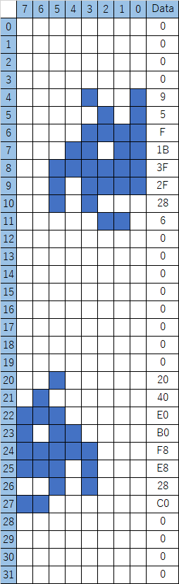  

この並び方は16x16であっても変わることはありません。  

色情報はスプライト1枚毎に1色指定出来ますので、  
8x8サイズの場合は 「0x7,0x7,0x7,0x7」が、
16x16サイズの場合は 「0x7」がスプライトデータの後ろに連結されます。

また、MSXの仕様上スプライトは1枚1色ですが、スプライトを重ねることにより4色までのデータを作成できるようになっています。

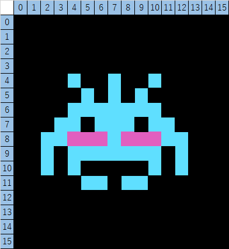  

このように2色使用したデータはスプライト2枚分(16x16時)のデータが作成されます。  
(色情報も2枚分)

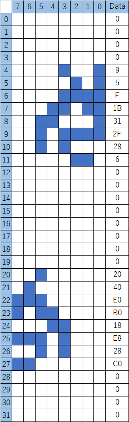  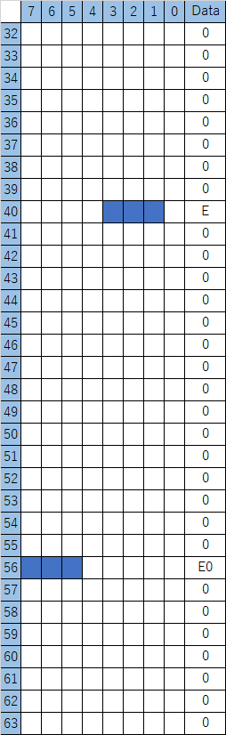  

※画像データにデザインがされていない領域(全て0)がある場合、その箇所のスプライトデータは作成されません。

### tmxmap
Tiled Map Editorで作成したtmxデータ内のマップデータを読み込みます。
```
byte[] foo = from("map.tmx", tmxmap);
```
エディタでこのようなデザインをした場合
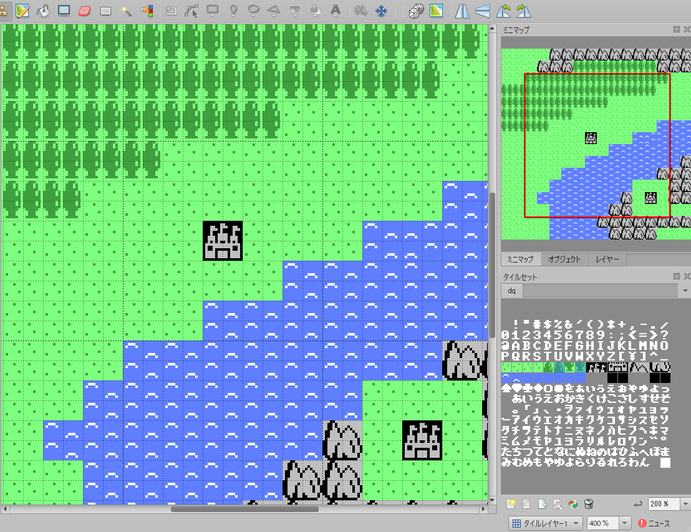  

マップデータは以下のような形式でmap.tmxに定義されていますので、これを1マス1バイトのデータとして読み込みます。
```
99,100,99,100,…
109,110,109,110,…
99,100,99,100,…
109,110,109,110,…
…
```

### tmxmap2
tmxmapと同様にマップデータを読み込みますが、データの格納方式が2x2単位のデータを並べて格納します。  
このオプションはタイルの組み合わせ定義に使用することを想定しています。

```
byte[] foo = from("tile.tmx", tmxmap2);
```

以下のようなデータは  
  

このように並び替えが行われて格納されます。  
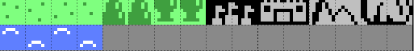  

これはタイルの組み合わせを予めデザインすることで、マップデータのサイズを小さくするのに役立ちます。  
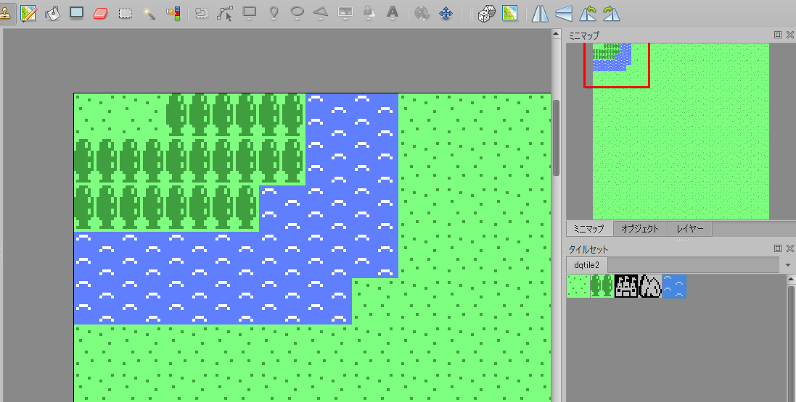  
※ここで使用するタイルセットの画像は別途用意しなければならない。  

tmxmapのままでは16x16を表現するのに4バイト必要としますが、この方式を併用することで1バイトで済ますことが出来ます。  
ただし、この1バイトを4マスに展開する処理はプログラムで作りこむ必要があります。  

### csv
csvファイルを取り込みます。セルの値は0～255である必要があります。
```
byte[] foo = from("data.csv", csv);
```

### rle
オプションにrleを追加するとRLE圧縮(PackBits方式)します。
```
byte[] foo = from("map.tmx", tmxmap, rle);  // 圧縮されているのでこのままでは使えません
```
終端データには0が設定されます。  
長さデータで0を読み取った場合に展開処理を終了するようにしてください。

### rle2
rle2はtmxmap専用のフォーマットになります。  
rle2は指定サイズのブロック毎にRLE圧縮されたテーブルを作成します。  
rleオプションと違い0で終了しませんので、ブロックの終端を展開したら終了するように作る必要があります。
デフォルトでは16x16サイズで分割します。
```
byte[] foo = from("map.tmx", tmxmap, rle2);  // 圧縮されているのでこのままでは使えません
```
rle2は先頭データから2バイトずつ、ブロックへのオフセット値を持ちます。

|アドレス|データの意味|
|--|--|
|+0|ブロック(0, 0)へのオフセット値|
|+2|ブロック(2, 0)…|
|+n|ブロック(x, y)…|
|…|… 分割数分続く|
|(0, 0)の格納アドレス|RLEデータ|
|(2, 0)の格納アドレス|RLEデータ|
|(x, y)の格納アドレス|RLEデータ|
|…|…|


### その他

from関数はデータの仕様を押し付けたくないため、必要最低限のデータしか取り込まないようになっています。  
例えばマップデータは縦横のサイズをデータ内に持っていません。  
RPGでマップデータを外部ファイルで持ちたい場合などは、別途データビルド用のxsmファイルを作るとよいでしょう。
例えばこのようなxsmファイルを作成しビルドすると、作成されたバイナリの先頭2バイトはマップのサイズを持つことになります。
```
// outputをtown1.mapとする
byte width = 64;
byte height = 64;
byte[] foo = from("town1.tmx", tmxmap);
```
